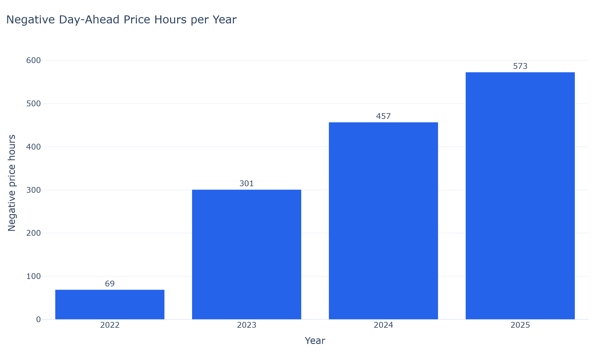
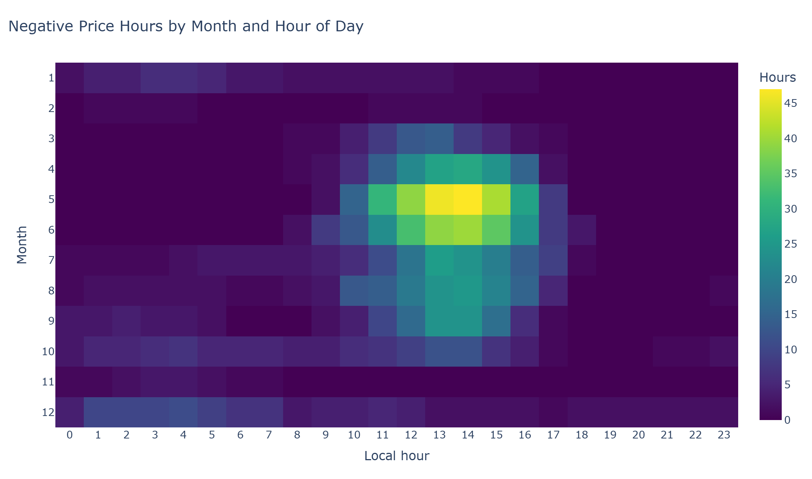
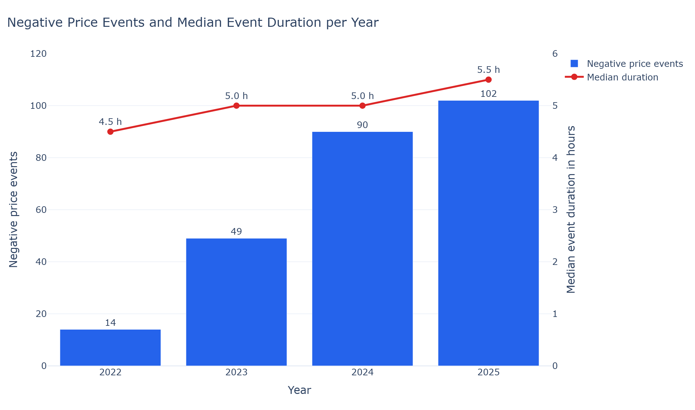

# Negative Day-Ahead Price Analysis

This is a learning project for SQL, ETL/ELT, PostgreSQL, and energy data analysis. It is not intended to be a complete electricity-market study. The goal is to build a small data pipeline around SMARD data and use it for a first exploratory analysis of negative day-ahead electricity prices in the Germany/Luxembourg (DE-LU) bidding zone.

For the full analysis, charts, and interpretation, see [docs/negative_price_analysis.md](docs/negative_price_analysis.md).

## What Problem Does This Address?

Negative day-ahead prices occur when the day-ahead market clears below zero. This often happens in low residual-load situations, when demand is low relative to wind and solar generation and some generators have limited incentives or ability to reduce output. Negative prices are not automatically a system failure, but they are an important signal for flexibility needs.

This project asks:

- When do negative day-ahead prices occur?
- Which system conditions are associated with them?
- Are negative price events becoming more frequent or longer?
- How useful could these event windows be for flexible electricity demand?

## What Data Is Used?

The analysis uses hourly SMARD data for the DE-LU bidding zone for the full calendar years 2022 to 2025:

- Day-ahead electricity prices
- Grid load
- Wind generation and wind forecasts
- Solar generation and solar forecasts
- Holiday and calendar information for weekday, weekend, and holiday grouping

The main derived metrics are residual load, forecasted residual load, continuous negative price events, event duration, and a simple price-depth measure per event.

Note on 2025 comparability: the European day-ahead market switched from 60-minute to 15-minute market time units on 30 September 2025 for delivery from 1 October 2025. This project still uses the hourly SMARD price series, so Q4 2025 should be treated as an hourly price index view rather than the native 15-minute market granularity.

## What Was Built Technically?

The repository contains a small Python and PostgreSQL data pipeline:

- Python ingestion code for SMARD API data and holiday reference data
- PostgreSQL base tables for raw imports, measurements, and holidays
- SQL quality views to inspect loaded data
- SQL analysis views for residual load, calendar features, negative price hours, and event logic
- Jupyter notebook for final chart export

## Key Findings

- Negative price hours increase strongly in the observed dataset, from 69 hours in 2022 to 573 hours in 2025.
- Negative prices occur especially around midday and are more common in spring and summer.
- Weekends and holidays show a higher negative-price share than regular weekdays.
- Negative price hours are usually associated with low forecasted residual load, but residual load alone does not explain every case.
- Negative price events become more frequent, while the median event duration stays in a narrow range.
- Most negative price events last between one and eight hours, which makes the minimum runtime of a flexible load important.

### Selected Results



Negative price hours rise clearly across the observed years.



Negative prices are concentrated around midday, especially from spring into summer.



The number of negative price events increases, while the median event duration stays relatively stable.

## Limits

- The analysis is descriptive and does not estimate causal effects.
- Residual load only uses wind and solar generation.
- From 1 October 2025 onward, hourly day-ahead prices are less directly comparable with earlier native hourly products because the underlying market time unit changed to 15 minutes.
- The project does not include grid constraints, plant-level constraints, bidding strategies, balancing markets, or cross-border effects.
- Flexible load screening only checks event duration and a simple price-depth measure. It does not model profitability.
- Low positive prices can also be relevant for flexible demand, but this project focuses on prices below zero.

## Data Validation

The database includes quality views for missing hourly measurements and basic impossible values. The main analysis and quality checks are scoped to the DE-LU bidding zone and hourly resolution.

## Setup

Requirements:

- Python 3.10 or newer
- Docker with Docker Compose
- A local `.env` file based on `.env.example`
- A notebook-capable environment such as VS Code or Jupyter

Install dependencies:

```powershell
python -m venv .venv
.\.venv\Scripts\activate
pip install -r requirements.txt
```

For development and tests, install the extra test dependency and run pytest:

```powershell
pip install -r requirements-dev.txt
python -m pytest
```

Create the environment file:

```powershell
copy .env.example .env
```

Start PostgreSQL:

```powershell
docker compose up -d
```

Load holidays, ingest SMARD data, and recreate SQL views:

```powershell
python scripts/ingest_holidays_and_smard.py
```

Generate the documentation charts by opening and running:

```text
notebooks/generate_negative_price_doc_charts.ipynb
```

The exported chart PNGs are written to `docs/assets/charts/`.
