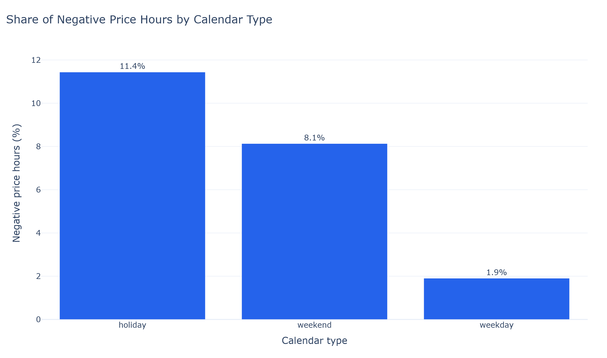
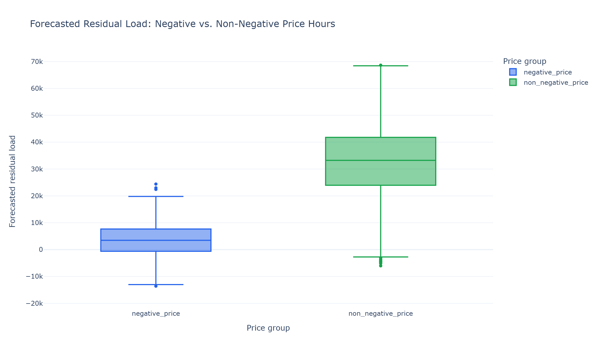
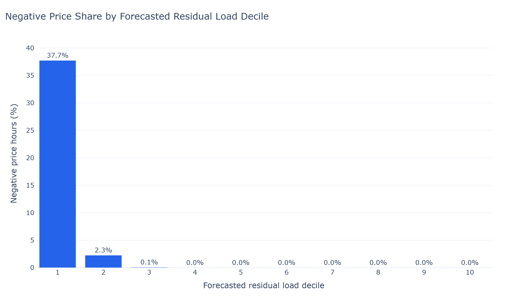
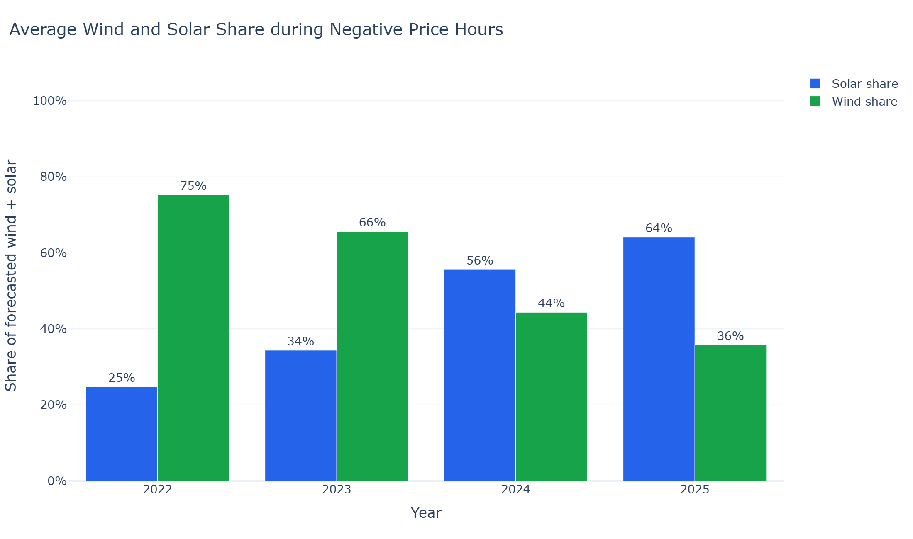
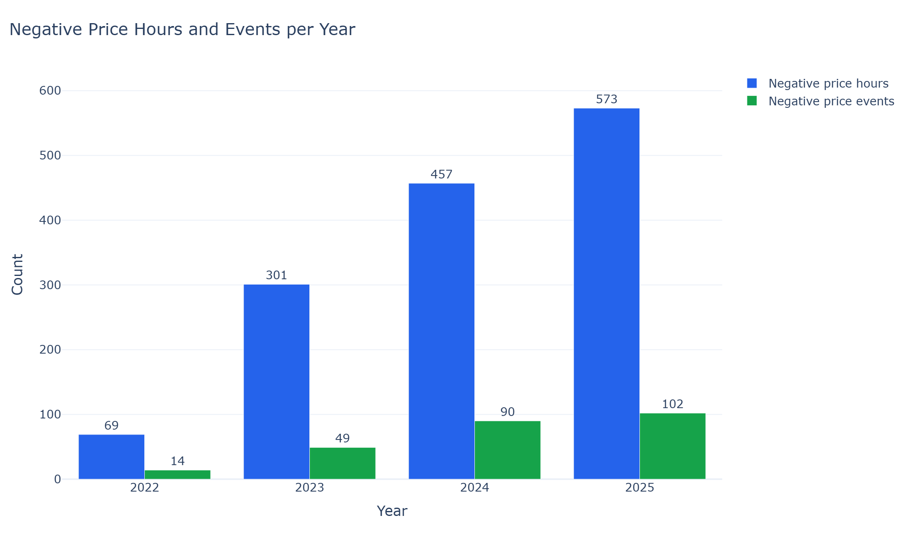
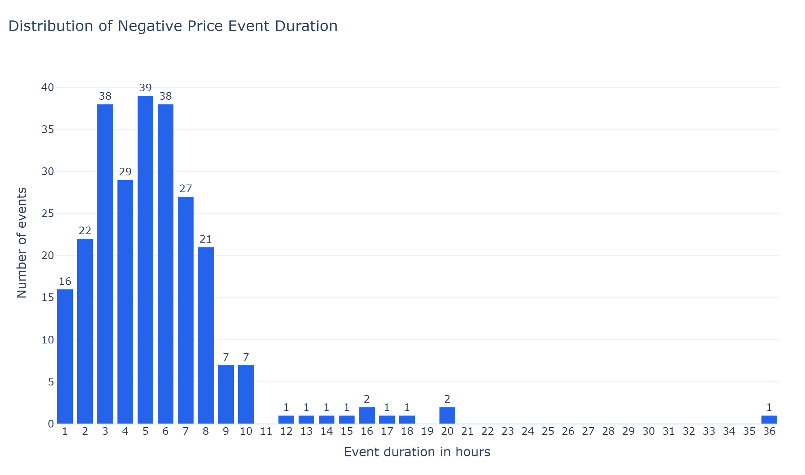
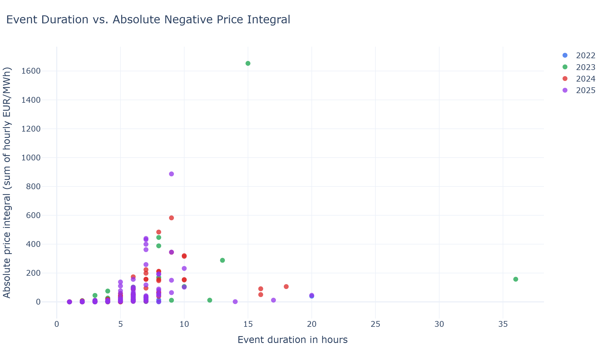
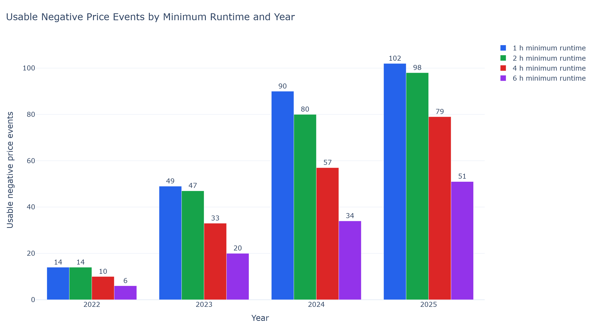

# Negative Day-Ahead Price Analysis

## 1. Project Context

This is a learning project for SQL, ETL/ELT, PostgreSQL, and energy data analysis. It is not intended to be a complete electricity-market study. The goal is to build a small data pipeline around SMARD data and use it for a first exploratory analysis of negative day-ahead electricity prices in the Germany/Luxembourg (DE-LU) bidding zone.

The guiding question is simple: when negative prices occur, what do they look like in the data, and how useful could these time windows be for flexible electricity demand?

## 2. Data Source and Scope

The analysis uses hourly SMARD data for the DE-LU bidding zone and currently covers the full calendar years 2022 to 2025. The pipeline loads day-ahead prices, grid load, wind generation, solar generation, and corresponding forecast values where available. A separate holiday reference table is used to distinguish weekdays, weekends, and holidays.

Important definitions used in the analysis:

- Negative price hour: an hour where `day_ahead_price < 0`.
- Residual load: grid load minus wind and solar generation.
- Forecasted residual load: forecasted grid load minus forecasted wind and solar generation.
- Negative price event: a continuous block of consecutive negative price hours.
- Flexible load window: a negative price event that is at least as long as a given minimum runtime.
- Price integral: the sum of hourly day-ahead prices within a negative price event. The chart uses the absolute value so larger values mean a stronger negative-price signal.
- Units: day-ahead prices are in EUR/MWh; load, generation, and residual-load values use the hourly SMARD MWh series.

The analysis is descriptive. It shows patterns and associations in the available data, but it does not claim to explain the full market mechanism behind negative prices.

## 3. Pipeline Overview

The project ingests SMARD API data into PostgreSQL, stores raw measurement values, and builds SQL views for quality checks and analysis.

Main pipeline pieces:

- `src/smard_catalog.py`: SMARD series configuration.
- `src/smard_pipeline.py`: SMARD ingestion flow.
- `src/holiday_pipeline.py`: holiday reference ingestion.
- `db/001_create_tables.sql`: base tables.
- `db/002_create_quality_views.sql`: quality views.
- `db/003_create_analysis_views.sql`: analysis views and event logic.

## 4. Analysis Questions

The documentation follows six questions:

- Are negative price hours increasing over time?
- When do they occur during the year, week, and day?
- Which system conditions are associated with them?
- Are negative price events becoming more common or longer?
- How large is the negative day-ahead price signal inside events?
- How many events would be usable by flexible loads with different minimum runtimes?

## 5. Findings

### 5.1 Negative Price Hours Are Increasing

The bars count all hours per year where the day-ahead price is below zero. The count rises from 69 hours in 2022 to 573 hours in 2025, showing that negative prices become much more frequent in this dataset.

### 5.2 Negative Prices Follow Clear Time Patterns

The heatmap counts negative price hours by calendar month and local hour. The concentration around midday, especially from spring into summer, shows a clear time pattern that is consistent with solar-heavy hours but does not by itself prove the cause.

The bars show the share of hours with negative prices within each calendar type. Holidays and weekends have higher shares than regular weekdays, indicating that calendar-related demand patterns are relevant without isolating demand as the only driver.

### 5.3 Low Residual Load Matters, But Does Not Explain Everything

The box plot compares forecasted residual load for negative and non-negative price hours. Negative-price hours are generally much lower, while non-negative hours also include some low and negative residual-load observations, so residual load is important but not sufficient on its own.

The bars group all hours into deciles by forecasted residual load. Negative price shares are highest in the lowest residual-load decile, supporting the relationship from the box plot while still leaving other drivers outside this analysis.

### 5.4 Wind and Solar Composition Changes Over Time

The bars show the average solar and wind shares within combined forecasted wind and solar generation during negative price hours. The solar share rises from 2022 to 2025, which fits the midday pattern above, but the result remains descriptive because the project does not compare the full generation mix or model technology-specific price effects.

### 5.5 Negative Price Events Are Becoming More Frequent

The grouped bars compare negative price hours with the number of continuous negative price events per year. Both measures increase over the observed period, so negative prices become more frequent both as individual hours and as continuous event windows.

The bars show the number of negative price events per year, while the line shows the median event duration. Event counts rise strongly, while the median duration only moves from 4.5 to 5.5 hours, so the growth is linked more to more frequent events than to a large change in typical event length.

The bars count events by duration in hours across the full dataset. Most events are between one and eight hours long, which matters for flexible demand because a process must fit into the available event duration.

Each point is one negative price event. The x-axis shows duration, and the y-axis shows the absolute price integral, which combines duration and price depth; it is not a profit estimate, but it indicates the size of the negative day-ahead price signal within each event.

### 5.6 Flexible Load Screening

The grouped bars count events that are at least one, two, four, or six hours long. Shorter runtime requirements retain more usable windows in every year, while six-hour processes have fewer options. Because event counts increase over time, negative price events are a useful starting point for thinking about demand-side flexibility, even though a real business case would also need prices, capacity, efficiency losses, process constraints, and grid fees.

## 6. Interpretation

Negative prices in this analysis are best understood as a visible signal of low residual-load situations in the day-ahead market. They are associated with high wind and solar generation, lower demand periods, and recurring event windows.

For flexible loads, the key result is not simply that negative prices exist. The more relevant question is whether negative price events are long enough, frequent enough, and strong enough in price signal for a specific process. This project gives a first SQL-based screening of that question.

## 7. Limitations

- The analysis is descriptive and does not estimate causal effects.
- Residual load only uses wind and solar generation.
- The analysis does not include grid constraints, plant-level constraints, bidding strategies, balancing markets, or cross-border effects.
- Flexible load screening only checks event duration and a simple day-ahead price-integral signal. It does not model profitability.
- Negative prices are a clear boundary for a first analysis, but low positive prices can also be relevant for flexible demand.

## 8. Reproducibility

The core workflow is:

1. Configure the local PostgreSQL connection with `.env`.
2. Start the database from `compose.yaml`.
3. Run the ingestion script for holidays and SMARD data.
4. Create or refresh the SQL views.
5. Run `notebooks/generate_negative_price_doc_charts.ipynb` to export the final PNG files into `docs/assets/charts/`.

## Appendix

### Chart Inventory

- `negative_price_hours_per_year.png`
- `negative_price_hours_month_hour.png`
- `negative_price_share_calendar_type.png`
- `forecasted_residual_load_price_groups.png`
- `negative_price_share_residual_load_decile.png`
- `wind_solar_share_negative_hours.png`
- `negative_hours_and_events_per_year.png`
- `negative_events_and_median_duration_by_year.png`
- `event_duration_distribution.png`
- `event_duration_vs_price_integral.png`
- `usable_events_by_minimum_runtime_by_year.png`

### Main SQL Views

- `hourly_market_features`
- `hourly_calendar_features`
- `hourly_system_features`
- `hourly_negative_price_features`
- `negative_price_event_hours`
- `negative_price_events`
- `yearly_negative_price_event_summary`
